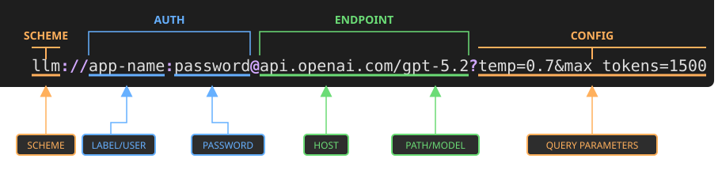

<div align="center">

# 🔗 llm-strings

**Connection strings for LLMs. Like database URLs, but for AI.**

[](https://www.npmjs.com/package/llm-strings)
[](https://github.com/justsml/llm-strings/blob/main/LICENSE)
[](https://www.typescriptlang.org/)
[](https://www.npmjs.com/package/llm-strings)
[](https://nodejs.org/)
[](https://bundlejs.com/?q=llm-strings)
[](https://bundlejs.com/?q=llm-strings&exports=parse)

**Parse, normalize, validate, and build portable `llm://` URLs across AI providers.**

[Playground](https://elite-libs.github.io/llm-strings/index.html) · [Install](#install) · [Quick Start](#quick-start) · [Examples](#examples) · [Supported Providers](#supported-providers) · [API](#api-reference)

</div>

---



```css
llm://openai/gpt-6-astra?effort=medium&maxTokens=2000
llm://anthropic/claude-opus-5?cache=5m&effort=max
llm://bedrock/anthropic.claude-sonnet-5?cache=1h&max=4096
llm://openrouter/anthropic/claude-sonnet-5?cache=true&max=2000
```

Every LLM provider invented slightly different names for the same knobs:
`max_tokens` vs `maxOutputTokens` vs `maxTokens`, `top_p` vs `topP` vs `p`,
`stop` vs `stop_sequences` vs `stopSequences`.

**llm-strings** gives you one portable format for model configuration. Put the
whole config in an env var, normalize it to the provider's API shape, validate
it before you spend tokens, and build UI controls from the same metadata.

Based on the [LLM Connection Strings](https://danlevy.net/llm-connection-strings/)
proposal by Dan Levy. See the [draft IETF RFC for `llm://`](https://datatracker.ietf.org/doc/html/draft-levy-llm-uri-scheme-00).

## Why developers use it

- **One config string** for host, model, credentials, and generation params.
- **Provider-native output** from provider-agnostic input like `cache=5m&max=2000`.
- **Early validation** for ranges, mutual exclusions, Bedrock model-family
  rules, and OpenAI reasoning-family normalization.
- **Short aliases** like `openai`, `anthropic`, `google`, `bedrock`, `groq`, and
  `openrouter`, with env overrides for private or regional endpoints.
- **AI SDK providerOptions** generation for provider-specific settings.
- **Zero runtime dependencies**, ESM + CJS, full TypeScript declarations, and
  sub-path imports for smaller bundles.

## Install

```bash
npm install llm-strings
```

```bash
pnpm add llm-strings
```

```bash
yarn add llm-strings
```

```bash
bun add llm-strings
```

## Quick Start

```ts
import { build, parse } from "llm-strings";
import { normalize } from "llm-strings/normalize";
import { validate } from "llm-strings/validate";

const input = "llm://anthropic/claude-sonnet-5?cache=5m&max=4096";

const parsed = parse(input);
// {
//   raw: "llm://anthropic/claude-sonnet-5?cache=5m&max=4096",
//   host: "api.anthropic.com",
//   hostAlias: "anthropic",
//   model: "claude-sonnet-5",
//   params: { cache: "5m", max: "4096" }
// }

const { config, provider } = normalize(parsed);
// {
//   provider: "anthropic",
//   config: {
//     raw: "llm://anthropic/claude-sonnet-5?cache=5m&max=4096",
//     host: "api.anthropic.com",
//     hostAlias: "anthropic",
//     model: "claude-sonnet-5",
//     params: {
//       cache_control: "ephemeral",
//       cache_ttl: "5m",
//       max_tokens: "4096"
//     }
//   }
// }

const issues = validate("llm://anthropic/claude-sonnet-5?cache=2h");
// [
//   {
//     param: "cache_ttl",
//     value: "2h",
//     severity: "error",
//     message: "\"cache_ttl\" must be one of [5m, 1h], got \"2h\"."
//   }
// ]

const url = build({
  host: "anthropic",
  model: "claude-sonnet-5",
  params: { cache: "1h", max: "4096" },
});
// "llm://api.anthropic.com/claude-sonnet-5?cache=1h&max=4096"
```

## Format

```css
llm://[label[:apiKey]@]host/model[?params]
```

| Part     | Required | Description                       | Example                    |
| -------- | -------- | --------------------------------- | -------------------------- |
| `label`  | No       | App name or environment label     | `worker`                   |
| `apiKey` | No       | API key in the password position  | `sk-proj-abc123`           |
| `host`   | Yes      | Provider host or short alias      | `api.openai.com`, `openai` |
| `model`  | Yes      | Model name, route, or provider ID | `gpt-6-astra`              |
| `params` | No       | Query-string generation settings  | `effort=medium&max=2000`   |

Connection strings can include secrets, so treat values containing `apiKey` like
credentials: store them in secret managers or env vars, and avoid logging them.

## Examples

### One env var for your model config

```bash
LLM_URL="llm://${APP_NAME-:llm-app}:${API_KEY-:sk-proj-abc123}@anthropic/claude-sonnet-5?cache=5m&max=4096"
```

```ts
import { parse } from "llm-strings";
import { normalize } from "llm-strings/normalize";

const { config, provider } = normalize(parse(process.env.LLM_URL!));

await fetch(`https://${config.host}/v1/chat/completions`, {
  method: "POST",
  headers: {
    Authorization: `Bearer ${config.apiKey}`,
    "Content-Type": "application/json",
  },
  body: JSON.stringify({
    model: config.model,
    messages: [{ role: "user", content: "Hello!" }],
    ...Object.fromEntries(
      Object.entries(config.params).map(([key, value]) => [
        key,
        Number.isNaN(Number(value)) ? value : Number(value),
      ]),
    ),
  }),
});

console.log(provider); // "anthropic"
```

## Use the AI SDK adapter

The AI SDK adapter is designed to help you map provider-specific options to the AI SDK's `providerOptions` format. It lives on a separate sub-path so you only load it when you need it:

```ts
const { createAiSdkProviderOptions } = await import("llm-strings/ai-sdk");

const { providerOptions } = createAiSdkProviderOptions(
  "llm://anthropic/claude-sonnet-5?cache=1h&effort=max",
);

// {
//   anthropic: {
//     cacheControl: { type: "ephemeral", ttl: "1h" },
//     effort: "max"
//   }
// }

// AI SDK call with providerOptions looks like this:
generateText({
  model: "claude-sonnet-5",
  // Use our providerOptions here
  providerOptions,
  messages: [{ role: "user", content: "Hello!" }],
});
```

Common generation settings like `temperature`, `top-p`, and max output tokens
belong on the AI SDK call itself. The helper emits provider-specific options
such as Anthropic cache control vs Bedrock cache points (for supporting models), OpenAI reasoning options,
Mistral `safePrompt`, OpenRouter routing, and Vercel AI Gateway routing,
including options such as `order`, `sort=ttft`, and `caching=auto`.

## Switch providers without changing app code

```bash
# OpenAI
LLM_URL="llm://openai/gpt-6-astra?max=2000&effort=medium"

# Anthropic
LLM_URL="llm://anthropic/claude-sonnet-5?cache=5m&max=2000"

# Google
LLM_URL="llm://google/gemini-3.8-flash?cache=5m&max=2000"

# Bedrock
LLM_URL="llm://bedrock/us.anthropic.claude-sonnet-5?cache=1h&max=2000"
```

```ts
import { parse } from "llm-strings";
import { normalize } from "llm-strings/normalize";

for (const value of [
  "llm://openai/gpt-6-astra?max=2000&effort=medium",
  "llm://anthropic/claude-sonnet-5?cache=5m&max=2000",
  "llm://google/gemini-3.8-flash?cache=5m&max=2000",
]) {
  const { config, provider } = normalize(parse(value));
  console.log(provider, config.params);
}

// openai {
//   max_completion_tokens: "2000",
//   reasoning_effort: "medium"
// }
// anthropic {
//   cache_control: "ephemeral",
//   cache_ttl: "5m",
//   max_tokens: "2000"
// }
// google {
//   maxOutputTokens: "2000"
// }
```

### Resolve short host aliases

```ts
import { parse } from "llm-strings";
import { normalize } from "llm-strings/normalize";

const { config, provider } = normalize(
  parse("llm://groq/openai/gpt-oss-120b?max=1000"),
);

config.host; // "api.groq.com"
provider; // "groq"
config.params; // { max_tokens: "1000" }
```

Override any alias at deploy time:

```bash
LLM_STRINGS_OPENAI_HOST="regional.openai.example.com"
LLM_STRINGS_BEDROCK_HOST="https://bedrock-runtime.us-west-2.amazonaws.com/model"
```

The alternate form `LLM_STRINGS_HOST_OPENAI` is also supported. Overrides may
include a scheme or path; only the host portion is used.

### Validate before calling the provider

```ts
import { validate } from "llm-strings/validate";

validate("llm://anthropic/claude-sonnet-5?cache=2h");
// [{ param: "cache_ttl", message: "\"cache_ttl\" must be one of [5m, 1h], got \"2h\".", ... }]

validate("llm://anthropic/claude-sonnet-5?cache=5m&max=2000");
// [] — cache=5m normalizes to cache_control=ephemeral and cache_ttl=5m

validate("llm://fal/fal-ai/nano-banana-2?future_model_param=1");
// [] — unknown params pass through by default for model-specific schemas

validate("llm://fal/fal-ai/nano-banana-2?future_model_param=1", {
  strict: true,
});
// [
//   {
//     param: "future_model_param",
//     value: "1",
//     severity: "error",
//     message: "Unknown param \"future_model_param\" for fal."
//   }
// ]
```

### See exactly what changed

```ts
import { parse } from "llm-strings";
import { normalize } from "llm-strings/normalize";

const { changes } = normalize(
  parse("llm://bedrock/anthropic.claude-sonnet-5?cache=1h&max=4096"),
  { verbose: true },
);

for (const change of changes) {
  console.log(`${change.from} -> ${change.to} (${change.reason})`);
}

// cache -> cache_control (cache=1h -> cache_control=ephemeral for bedrock)
// cache -> cache_ttl (cache=1h -> cache_ttl=1h for bedrock)
// max -> max_tokens (alias: "max" -> "max_tokens")
// max_tokens -> maxTokens (bedrock uses "maxTokens" instead of "max_tokens")
```

### Build provider-aware UIs

```ts
import { CANONICAL_PARAM_SPECS, PROVIDER_META } from "llm-strings/providers";

PROVIDER_META.map(({ id, name, host, color }) => ({ id, name, host, color }));
// [{ id: "openai", name: "OpenAI", host: "api.openai.com", color: "#10a37f" }, ...]

CANONICAL_PARAM_SPECS.anthropic.cache_ttl;
// {
//   type: "enum",
//   values: ["5m", "1h"],
//   default: "5m",
//   description: "Cache TTL"
// }
```

Model availability changes much faster than package releases. Query either
gateway's public catalog at runtime instead of relying on a bundled snapshot:

```ts
import { listAvailableModels } from "llm-strings/model-catalog";

const openAiModels = await listAvailableModels({
  source: "vercel", // or "openrouter"
  provider: "openai",
});
```

Each entry contains a normalized model ID, provider, context window, output
limit, and `supportedParameters` when published by the source. The helper makes
no request at import time and accepts an `AbortSignal` or custom `fetch`.

### Opt-in provider-aware checks

The base `llm-strings` entry only parses/builds connection strings and resolves
lightweight host shorthands. Provider/model-aware normalization and validation
are deliberately split into opt-in paths:

```ts
import { parse } from "llm-strings";
import { safeParse } from "llm-strings/safe";

const raw = parse("llm://openai/gpt-6-astra?effort=high");
const checked = safeParse("llm://openai/gpt-6-astra?effort=high");

if (checked.success) {
  checked.config; // provider-normalized settings
  checked.issues; // warnings, if any
}
```

Import `llm-strings/ai-sdk` only when AI SDK `providerOptions` shaping is
needed. Importing the base parser does not include validation tables, AI SDK
adapters, live catalog code, or a bundled model/capability list.

## Supported Providers

`llm-strings` ships provider detection, host aliases, metadata, and parameter
normalization for the major LLM provider shapes. Chat-compatible providers get
canonical parameter mapping and validation; media and audio providers are
available for detection, metadata, aliases, and flexible AI SDK providerOptions.

| Category                    | Providers                                                                                                                                                                                                                     |
| --------------------------- | ----------------------------------------------------------------------------------------------------------------------------------------------------------------------------------------------------------------------------- |
| Core chat + reasoning       | OpenAI, Azure OpenAI, Anthropic, Google AI Studio, Google Vertex AI, Mistral, Cohere, AWS Bedrock, OpenRouter, Vercel AI Gateway                                                                                              |
| OpenAI-compatible APIs      | xAI, Meta, Groq, DeepInfra, Together.ai, Fireworks, DeepSeek, Moonshot AI, Perplexity, Alibaba DashScope, Cerebras, Baseten, Hugging Face                                                                                     |
| Media, audio, and flexible  | Fal, Black Forest Labs, Replicate, Prodia, Luma, ByteDance, Kling AI, ElevenLabs, AssemblyAI, Deepgram, Gladia, LMNT, Hume, Rev.ai                                                                                            |
| Extra aliases and endpoints | `aistudio`, `vertex`, `grok`, `bfl`, `dashscope`, `alibabacloud`, `togetherai`, `fireworksai`, `moonshot`, `wandb`, `weightsandbiases`, `baidu`, `qianfan`, `venice`, `parasail`, `novita`, `atlascloud`, `xiaomi`, `minimax` |

### Provider table

| Provider ID         | Default host                              | Param style       |
| ------------------- | ----------------------------------------- | ----------------- |
| `openai`            | `api.openai.com`                          | snake_case        |
| `anthropic`         | `api.anthropic.com`                       | snake_case        |
| `bedrock`           | `bedrock-runtime.us-east-1.amazonaws.com` | camelCase         |
| `openrouter`        | `openrouter.ai`                           | OpenAI-compatible |
| `vercel`            | `gateway.ai.vercel.app`                   | OpenAI-compatible |
| `xai`               | `api.x.ai`                                | OpenAI-compatible |
| `google`            | `generativelanguage.googleapis.com`       | camelCase         |
| `google-vertex`     | `aiplatform.googleapis.com`               | camelCase         |
| `azure`             | `models.inference.ai.azure.com`           | OpenAI-compatible |
| `mistral`           | `api.mistral.ai`                          | snake_case        |
| `cohere`            | `api.cohere.com`                          | mixed             |
| `meta`              | `api.meta.ai`                             | OpenAI-compatible |
| `groq`              | `api.groq.com`                            | OpenAI-compatible |
| `fal`               | `fal.run`                                 | flexible          |
| `deepinfra`         | `api.deepinfra.com`                       | OpenAI-compatible |
| `black-forest-labs` | `api.bfl.ai`                              | flexible          |
| `together`          | `api.together.xyz`                        | OpenAI-compatible |
| `fireworks`         | `api.fireworks.ai`                        | OpenAI-compatible |
| `deepseek`          | `api.deepseek.com`                        | OpenAI-compatible |
| `moonshotai`        | `api.moonshot.ai`                         | OpenAI-compatible |
| `perplexity`        | `api.perplexity.ai`                       | OpenAI-compatible |
| `alibaba`           | `dashscope-intl.aliyuncs.com`             | OpenAI-compatible |
| `cerebras`          | `api.cerebras.ai`                         | OpenAI-compatible |
| `replicate`         | `api.replicate.com`                       | flexible          |
| `prodia`            | `api.prodia.com`                          | flexible          |
| `luma`              | `api.lumalabs.ai`                         | flexible          |
| `bytedance`         | `ark.cn-beijing.volces.com`               | flexible          |
| `kling`             | `api.klingai.com`                         | flexible          |
| `elevenlabs`        | `api.elevenlabs.io`                       | flexible          |
| `assemblyai`        | `api.assemblyai.com`                      | flexible          |
| `deepgram`          | `api.deepgram.com`                        | flexible          |
| `gladia`            | `api.gladia.io`                           | flexible          |
| `lmnt`              | `api.lmnt.com`                            | flexible          |
| `hume`              | `api.hume.ai`                             | flexible          |
| `revai`             | `api.rev.ai`                              | flexible          |
| `baseten`           | `api.baseten.co`                          | OpenAI-compatible |
| `huggingface`       | `api-inference.huggingface.co`            | OpenAI-compatible |

## Shorthand aliases

Use short, memorable query params. `normalize()` expands them first, then maps
them to provider-native names.

| Shorthand                                                                                                    | Canonical           |
| ------------------------------------------------------------------------------------------------------------ | ------------------- |
| `temp`                                                                                                       | `temperature`       |
| `max`, `max_out`, `max_output`, `max_output_tokens`, `maxTokens`, `maxOutputTokens`, `max_completion_tokens` | `max_tokens`        |
| `topp`, `topP`, `nucleus`                                                                                    | `top_p`             |
| `topk`, `topK`                                                                                               | `top_k`             |
| `freq`, `freq_penalty`, `frequencyPenalty`, `repetition_penalty`                                             | `frequency_penalty` |
| `pres`, `pres_penalty`, `presencePenalty`                                                                    | `presence_penalty`  |
| `stop_sequences`, `stopSequences`, `stop_sequence`                                                           | `stop`              |
| `random_seed`, `randomSeed`                                                                                  | `seed`              |
| `candidateCount`, `candidate_count`, `num_completions`                                                       | `n`                 |
| `reasoning`, `reasoning_effort`                                                                              | `effort`            |
| `cache_control`, `cacheControl`, `cachePoint`, `cache_point`                                                 | `cache`             |

## Prompt caching

```ts
import { parse } from "llm-strings";
import { normalize } from "llm-strings/normalize";

normalize(parse("llm://anthropic/claude-sonnet-5?max=4096&cache=true")).config
  .params;
// { max_tokens: "4096", cache_control: "ephemeral" }

normalize(parse("llm://anthropic/claude-sonnet-5?max=4096&cache=5m")).config
  .params;
// { max_tokens: "4096", cache_control: "ephemeral", cache_ttl: "5m" }

normalize(parse("llm://bedrock/anthropic.claude-sonnet-5?cache=1h")).config
  .params;
// { cache_control: "ephemeral", cache_ttl: "1h" }
```

Caching currently normalizes for Anthropic and supported Bedrock models. For
Anthropic, `cache=5m` and `cache=1h` are both supported. For Bedrock, support is
model-family specific and currently covers Claude and Amazon Nova models. For
providers where caching is automatic, unsupported, or provider-specific in a way
that should not be represented as a generation param, `cache` is dropped during
normalization.

## Sub-path imports

```ts
import { build, parse } from "llm-strings/parse";
import { normalize } from "llm-strings/normalize";
import { validate } from "llm-strings/validate";
import { createAiSdkProviderOptions } from "llm-strings/ai-sdk";
import {
  ALIASES,
  CANONICAL_PARAM_SPECS,
  HOST_ALIASES,
  PARAM_SPECS,
  PROVIDER_META,
  PROVIDER_PARAMS,
  detectProvider,
  resolveHostAlias,
} from "llm-strings/providers";
```

All sub-paths ship ESM + CJS with full type declarations.

## API Reference

### `parse(connectionString): LlmConnectionConfig`

Parses an `llm://` connection string into structured config. Throws when the
scheme is not `llm://`.

### `build(config): string`

Builds an `llm://` connection string from a config object. This is the inverse
of `parse()`.

### `normalize(config, options?): NormalizeResult`

Normalizes params for the detected provider:

1. Expands shorthand aliases such as `temp` -> `temperature`.
2. Maps canonical names to provider-specific names such as `max_tokens` ->
   `maxOutputTokens` for Google.
3. Normalizes cache values such as `cache=5m` -> `cache_control=ephemeral` and
   `cache_ttl=5m`.
4. Adjusts OpenAI reasoning-family params such as `max_tokens` ->
   `max_completion_tokens` and drops known unsupported sampling params.

Pass `{ verbose: true }` to get a `changes` array that documents each
transformation.

### `validate(connectionString, options?): ValidationIssue[]`

Parses, normalizes, and validates a connection string. Returns `[]` when the
config is valid. Checks include type correctness, numeric ranges, enum values,
unknown providers, Anthropic `temperature` + `top_p` mutual exclusion,
OpenAI reasoning-family normalization, and Bedrock model-family rules. Unknown
params are allowed by default so new model-specific schemas can pass through.

Pass `{ strict: true }` to report unknown providers or unknown params as
errors.

### `createAiSdkProviderOptions(input, options?): AiSdkProviderOptionsResult`

Creates AI SDK `providerOptions` from a string, parsed config, or normalize
result. Import from `llm-strings/ai-sdk`.

### Provider helpers

Import from `llm-strings/providers`:

| Export                          | Description                                                                           |
| ------------------------------- | ------------------------------------------------------------------------------------- |
| `detectProvider(host)`          | Detects provider from hostname.                                                       |
| `resolveHostAlias(host)`        | Expands aliases and applies `LLM_STRINGS_*_HOST` overrides.                           |
| `detectBedrockModelFamily()`    | Detects Anthropic, Meta, Amazon, Mistral, Cohere, or AI21 Bedrock families.           |
| `detectGatewaySubProvider()`    | Extracts provider prefix from gateway models like `anthropic/claude...`.              |
| `isReasoningModel(model)`       | Detects OpenAI GPT-5 and o-series reasoning models, including gateway-prefixed names. |
| `isGatewayProvider(provider)`   | Returns true for `openrouter` and `vercel`.                                           |
| `canHostOpenAIModels(provider)` | Returns true for providers that need OpenAI reasoning-model checks.                   |
| `bedrockSupportsCaching(model)` | Returns true for Bedrock Claude and Nova prompt caching support.                      |

### Constants

| Export                        | Description                                                                     |
| ----------------------------- | ------------------------------------------------------------------------------- |
| `ALIASES`                     | Shorthand -> canonical param name mapping.                                      |
| `HOST_ALIASES`                | Short provider host aliases -> canonical API hosts.                             |
| `PROVIDER_PARAMS`             | Canonical -> provider-specific param names, per provider.                       |
| `PARAM_SPECS`                 | Validation rules keyed by provider-specific param name.                         |
| `REASONING_MODEL_UNSUPPORTED` | Canonical params unsupported by OpenAI reasoning models.                        |
| `PROVIDER_META`               | Provider metadata for UI integrations.                                          |
| `CANONICAL_PARAM_SPECS`       | Canonical param specs per provider, useful for building forms and settings UIs. |

## TypeScript

```ts
import type { LlmConnectionConfig } from "llm-strings";

import type {
  NormalizeChange,
  NormalizeOptions,
  NormalizeResult,
} from "llm-strings/normalize";

import type { ValidateOptions, ValidationIssue } from "llm-strings/validate";

import type {
  BedrockModelFamily,
  CanonicalParamSpec,
  ParamSpec,
  Provider,
  ProviderMeta,
} from "llm-strings/providers";
```

## Development

```bash
pnpm install
pnpm test
pnpm run build
pnpm run lint
```

This package is intentionally small: pure TypeScript, zero runtime dependencies,
and focused tests for parsing, normalization, validation, provider metadata,
Bedrock behavior, gateway behavior, and AI SDK providerOptions.

## Contributing

Issues and pull requests are welcome. Good contributions include new provider
aliases, provider-specific validation rules, improved normalization mappings,
AI SDK providerOptions coverage, docs fixes, and real-world edge cases.

## License

MIT © Dan Levy

---

<div align="center">

**[Read the spec](https://danlevy.net/llm-connection-strings/) · [Report a bug](https://github.com/justsml/llm-strings/issues) · [Request a feature](https://github.com/justsml/llm-strings/issues)**

</div>
